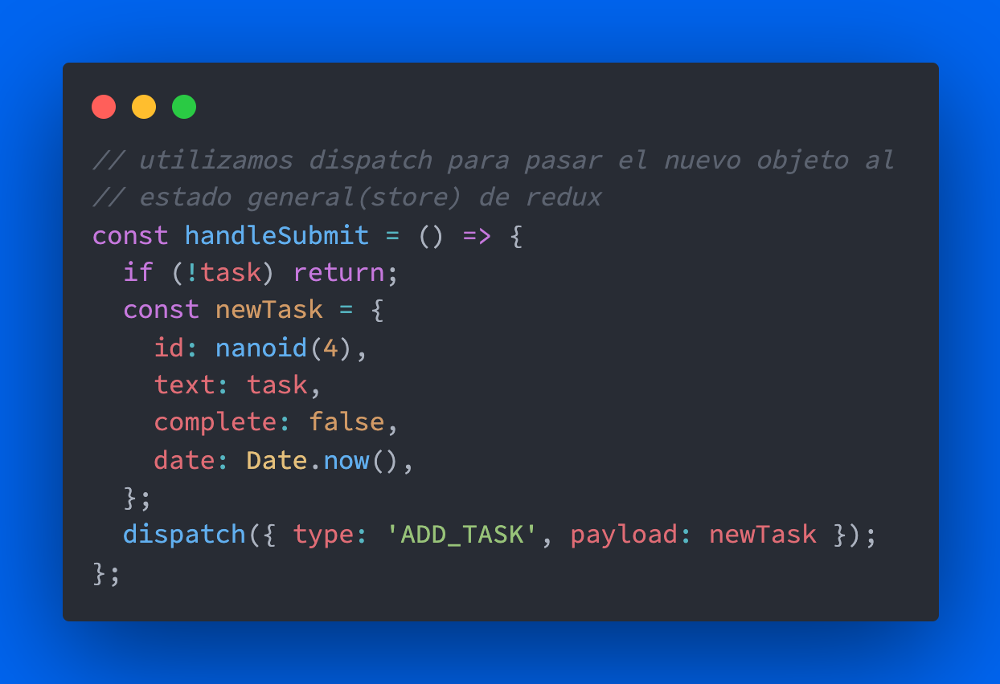

# TodoList with React - Redux - TailwindCSS

Redux is a great tool when the complexity of our application increases, as we are sending props deep from the components to their children. Since React already allows us to manage the state without Redux, it is a good idea to make a decision based on when I should add it. Here the project was carried out simply for learning purposes

## Each task is composed of 4 properties:

## To then continue with the following features:
- Filter completed/incomplete
- Login
- Save in LocalStorage
- ...
